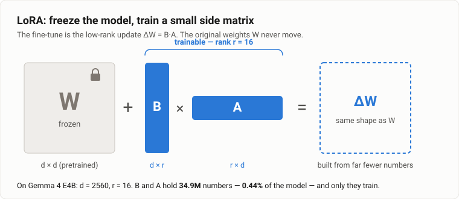
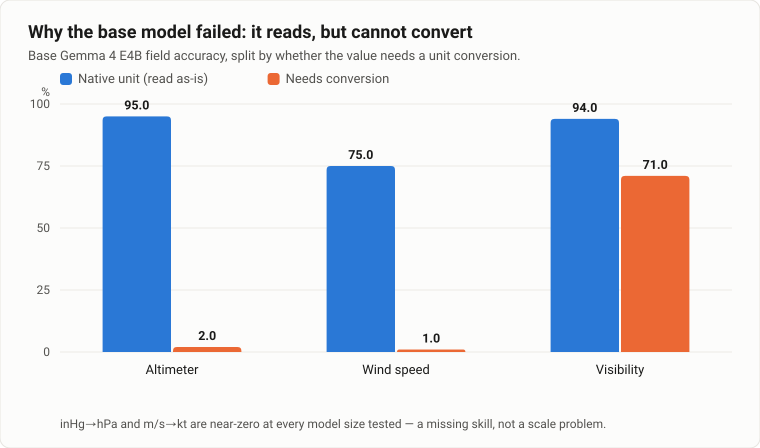
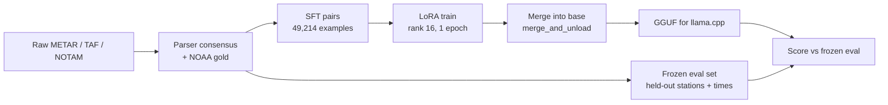
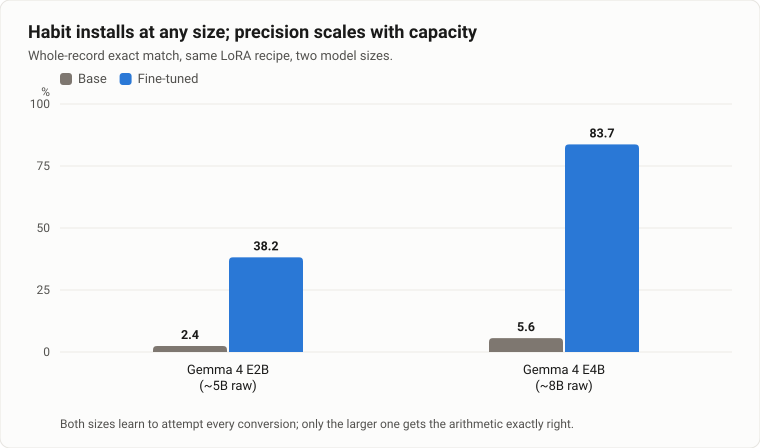
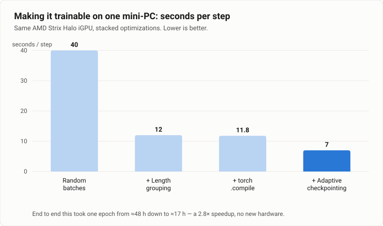
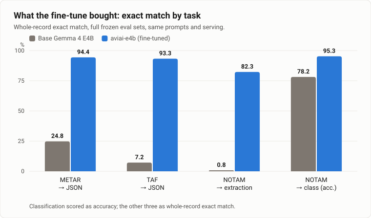
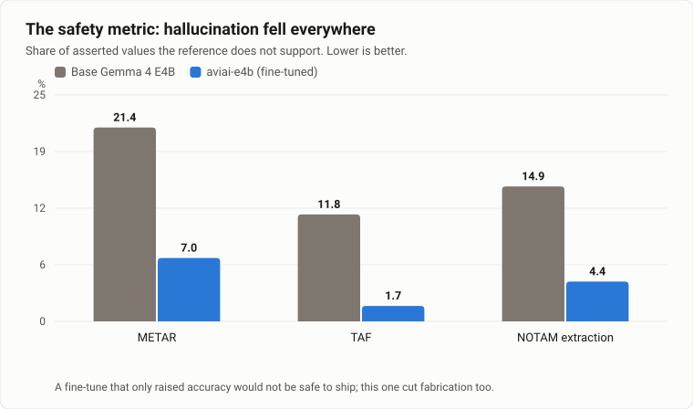

# Teaching a language model to read the weather: a LoRA journey

I set out to learn how LoRA fine-tuning actually works — not from a tutorial that
overfits MNIST, but from a task with a real, unforgiving answer key. So I picked
aviation weather: turn a raw **METAR**, **TAF**, or **NOTAM** into clean, canonical
JSON. Pilots read these strings; parsers decode them; and crucially, there is a
*correct* decode I can score against automatically.

What follows is the honest version of the journey — the detours, the number that
lied, and the moment a "hardware bug" turned out to be my own code. If you take one
thing away, let it be this: **when you fine-tune, the measurement is on trial as much
as the model.**

Everything here ran on one mini-PC — an AMD Strix Halo box (Ryzen AI Max+ 395,
Radeon 8060S iGPU, 123 GiB of unified memory). No cloud, no A100s.

---

## What LoRA actually is

A modern language model is mostly a stack of big weight matrices. Full fine-tuning
means nudging *all* of them — billions of numbers — which needs a lot of memory and
a lot of care not to wreck what the model already knows.

LoRA (Low-Rank Adaptation) makes a bet: the *change* you need for a new task is
"low rank." Instead of editing the weight matrix **W**, you freeze it and learn a
small side matrix, factored into two skinny matrices **B** and **A**. Their product
has the same shape as W, but is built from far fewer numbers.

*The base weights never move. Only the thin blue matrices train.*

On my model — Gemma 4 E4B — the frozen weights are 2560-wide. With rank `r = 16`,
the two adapter matrices together hold **34.9 million** numbers: **0.44%** of the
model. That is the whole fine-tune. It fits in memory easily, it trains fast, and
when you are done you can either keep the little adapter as a side file or *merge* it
back into the base so the result is an ordinary checkpoint again.

One footnote on the model, because it tripped me up later (see below): Gemma 4 E4B
is the "effective 4B" variant. It carries roughly **8B raw parameters** but runs with
the footprint of a ~4B model, thanks to per-layer embeddings it can page in and out.
It is also multimodal — text, vision, and audio towers. I only ever touched the text
tower.

---

## Rule zero: measure before you train

Before fine-tuning anything, I made the base model do the task and scored it. This
is the step it is tempting to skip, and it is the most valuable one, because it tells
you *what you are actually teaching.*

The base model was not clueless. It could clearly *read* a METAR — it got report
types, cloud layers, and temperatures mostly right. But its whole-record accuracy was
on the floor. When I broke the errors down by field, one culprit dominated:

*The base reads native units fine and collapses on anything requiring arithmetic.*

Altimeter pressure in hectopascals (`Q1015`): 95% right. The *same* pressure in
inches of mercury (`A3012`, which must become 1019 hPa): **2%**. Wind in knots: fine.
Wind in metres per second, which must be converted to knots: **1%**. The model knew
what the field *was*; it could not do the unit conversion.

Then I ran the same eval across a ladder of model sizes — 270M, 0.5B, 1B, 2B, 4B.
General decoding accuracy climbed steadily with size, exactly as you'd expect. The
conversion gap did not. inHg→hPa stayed at 0–1% at **every** size, including 4B.

That reframed the whole project. This was not a "make the model bigger" problem. It
was a specific, missing, learnable skill — the perfect thing to teach with a small
adapter.

---

## The detour that taught me the most: verify the linchpin fact

For several weeks I thought I was fine-tuning Gemma 4. I wasn't. The directory on
disk was named `gemma-4-E4B-it`, and I trusted the name. It was actually **Gemma 3n**.

The reason is almost funny: Gemma 4 shipped in April 2026, *after* the knowledge
cutoff of the assistant I was working with, so "does this model even exist yet, and
is this really it?" was a genuine question that had quietly decayed into an
assumption. A whole earlier "finding" I'd been proud of — an apparent 9-point
accuracy gap between two serving stacks — evaporated once I checked: it was the same
mislabelled Gemma 3n on both sides, not a stack difference at all.

The fix was one API call to confirm the model's identity, plus reading `model_type`
out of the config instead of the folder name. The lesson is bigger than one mistake:
**verify the load-bearing fact against reality before you build a month of work on
it — and re-verify it, because a check you did once can rot into a label you now
trust.**

---

## The fine-tune, and the one insight I keep

The recipe itself is unglamorous, which is the point — LoRA is meant to be boring:

| | |
|---|---|
| base | Gemma 4 E4B instruction-tuned, bf16 |
| method | LoRA rank 16, alpha 32, on the attention + MLP projections of the text tower |
| trainable | 34.9M params (0.44%) |
| data | 49,214 chat examples (METAR, TAF, and NOTAM tasks combined) |
| schedule | 1 epoch, AdamW, lr 2e-4, batch 6 × grad-accum 2, max 2048 tokens |
| result | train loss 0.62 → 0.13 |

The references those 49k examples are scored against don't come from me. They come
from a panel of established aviation parsers voting field-by-field, anchored to
NOAA's official decodes. That matters: my opinion is never the answer key, so a
"correct" label is an authority's, not mine.

Here is the pipeline, end to end:

I ran the same recipe at two model sizes, and the comparison produced the single
cleanest insight of the whole study:

*The fine-tune installs the habit at any size. The precision scales with capacity.*

Both sizes learned to *attempt* every conversion — the base did essentially none.
But getting a whole record *exactly* right needs the arithmetic to be precise, and
that is where capacity shows up. The 2B model converts approximately (`A2979` becomes
"about 1014" instead of 1009); the 4B converts exactly. So the fine-tune's **lift**
is huge at both sizes, but its **ceiling** scales with the model. Habit is cheap;
precision you pay for.

---

## The bug that isn't a bug: serve exactly how you trained

My freshly fine-tuned model scored a baffling 73% "valid output" the first time I
served it — worse, in a way, than the base. It was emitting the literal text
`<|turn>model` into its answers on 164 records.

The cause is subtle and worth internalising. I trained with one chat-template
renderer (Hugging Face Transformers) and served with another (llama.cpp, whose
template engine renders Gemma 4's chat format slightly differently). A base model
shrugs off that drift. But a *hard* fine-tune — mine reached a training loss near
0.1 — has overfit to the exact bytes of its training prompt. Change the prompt
rendering by a few characters and it shatters.

Feeding the model the raw training wrapper directly, byte-for-byte, took validity to
100%. The rule I wrote on the wall: **"same template, different engine" is a
different serving stack. Serve the way you trained, exactly.**

(A related Gemma 4 surprise: it's a *reasoning* model. Served naively it "thinks"
silently until it hits the token limit and returns nothing. It needs to be told to
answer directly.)

---

## One adapter for four jobs

I started with METAR. Then I added TAF (nested, multi-period forecasts), then NOTAM
extraction (free-text, category-keyed), then NOTAM classification (pick one of 13
operational classes). The obvious worry: would one small adapter, asked to do four
quite different shapes of task, end up mediocre at all of them?

It didn't. One rank-16 adapter trained on the mixed data **matched or beat every
single-task specialist** I trained for comparison. Flat JSON, nested JSON, free-text
rows, single labels — no interference. The model routes on the prompt, and the shared
"decode aviation text" signal seems to help rather than hurt.

I also tested whether more capacity in the adapter helped: rank 64 versus rank 16
bought +0.2 points of value accuracy and +1.8 of exact match, for four times the
adapter size. Not worth it. Rank 16 was the deployment choice — capacity was no
longer the bottleneck for this task.

---

## Making it fast enough to iterate on one iGPU

Training on a consumer AMD iGPU is its own adventure. The first real epoch was
projected at ~48 hours. That's too slow to learn anything from — you can't iterate on
a two-day loop. So I profiled a single training step, and the villain was not the
chip.

It was **padding, of my own making.** Random batches mixed short ~460-token METARs
with long ~1100-token TAFs, so every batch was padded to its longest member. Nearly
half of all the linear-algebra compute was spent on padding tokens. Sorting examples
by length before batching (so each batch is uniform) cut padding from ~49% to ~1%.

From there it stacked:

*Length grouping, then torch.compile, then length-adaptive gradient checkpointing.*

The last one I had to build: gradient checkpointing (recomputing activations to save
memory) is only worth its compute cost on the long examples. So I made it
*length-adaptive* — checkpoint only records above ~1800 tokens, roughly the longest
3%. End to end, one epoch went from ~48 hours to about 17, with no new hardware.

Two things about that iGPU I did not expect, and won't forget:

- **There is no clean out-of-memory error on an APU.** The "GPU memory" is really
  host RAM. Over-allocate and you don't get a tidy OOM — you get a swap storm and
  then a GPU page fault that looks *exactly* like a driver bug. I chased that as a
  hardware fault twice before realising it was my own memory budget.
- **Every standalone probe must put the model in training mode.** Three of my
  "measurements" were quietly wrong because a probe script left the model in eval
  mode, silently disabling the very checkpointing I was trying to measure. The real
  trainer was always fine; my microbenchmarks lied.

The production run landed at **16 hours 58 minutes**, first attempt, loss 0.62 →
0.13 — while a little userspace thermostat paused it whenever the chip crossed 101°C.
It ran *faster* under the thermostat, because a cooler chip clocks higher between
pauses.

---

## The payoff

Same frozen eval sets, same prompts, same serving on both sides. Base Gemma 4 E4B
versus the fine-tune:

*METAR, TAF, and NOTAM extraction are whole-record exact match; classification is accuracy.*

Whole-record exact match on METAR went from **24.8% to 94.4%**. TAF, the hardest
because it is deeply nested, went from **7.2% to 93.3%**. NOTAM extraction, mostly
free text, from under **1% to 82%**.

But accuracy alone would not be safe to ship. In a domain like this, a model that
confidently *invents* a value is worse than one that admits it doesn't know. So I
tracked hallucination — asserted values the reference doesn't support — separately,
and the fine-tune had to move it in the right direction too:

*Fabrication fell on every task. A fine-tune that only raised accuracy would not be enough.*

---

## What I'd tell myself at the start

- **Measure before you train.** The baseline is not a formality; it tells you the
  one skill you're actually teaching. Mine was unit conversion, and I'd never have
  known to look without scoring the base model first.
- **The measurement is on trial too.** More than once, a dramatic number — a "21%
  hard-case rate," a "7% hallucination rate" — dissolved under inspection into a bug
  in *my scoring code* or a quirk of one parser. Audit the ruler before you trust the
  measurement.
- **Verify the linchpin fact against reality.** Not the filename, not last week's
  assumption. The config, the API, the ground truth.
- **Serve exactly how you trained.** A hard fine-tune overfits its prompt bytes. The
  inference stack is part of the experiment.
- **Habit is cheap; precision scales with capacity.** LoRA can install a new behaviour
  at almost any size. How *exactly* right it gets that behaviour is what you pay model
  size for.

And the honest caveat I owe the numbers: my answer key is built from parsers and
official decodes, so the fine-tune is learning to *match the parser*, not to beat it.
The interesting frontier — can the model decode messy text the parsers choke on? —
needs a human-graded test set I haven't built yet. That's the next journey.

---

*The fine-tuned model, `aviai-e4b`, is a research artifact — a decode aid, not a
certified aeronautical tool. Don't fly on it.*
